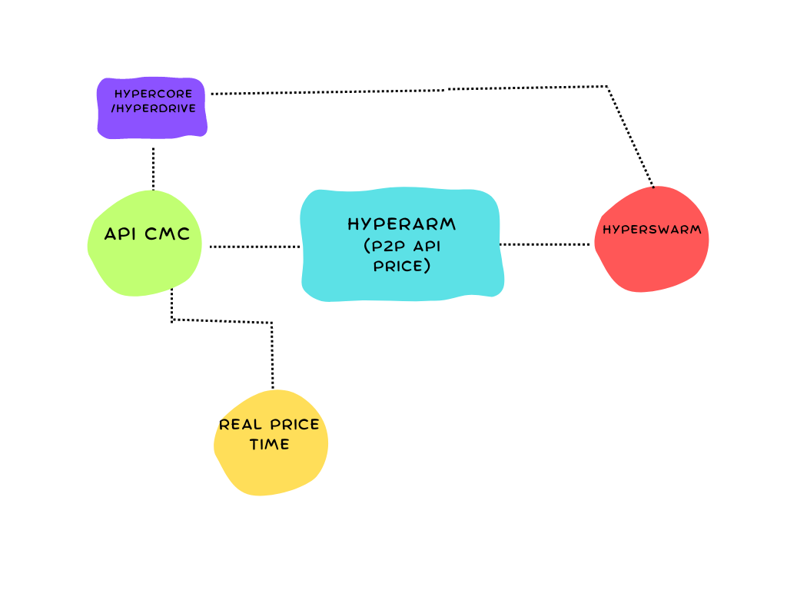

# HyperArm 🕳️🥊

 P2P API Bitcoin prices on Hypercore
 
# Service

Our product offer API price basead on Hypercore, HyperBee, Hyperswarm and Hyperdrive

# Features

- Real price time

- Bitcoin-only, not shitcoins

- P2P API powered by Hyperbee

- DHT (Distributed hash table) with Hyperswarm

- Hyperdrive for peer-to-peer file management

# How works?

<p align="center">
  <a href="https://github.com/AreaLayer/HyperArm" title="AreaLayer">
    </img>
  </a>
</p>

<h3 align="center">FireBolt</h3>


# How install

Install Hyperbee, Hyperdrive and hyperswarm from HyperCore

```
npm install hyperbee hypercore hyperdrive hyperswarm
```
Run local server

```
 http://localhost:3000/
```

Get pair 
```
curl http://localhost:3000/pairs
```

# Roadmap

- [ ] Beta software
- [x] Final tests
- [x] Integration with Hyperswarm and Hyperdrive for more P2P options


# Contribution

[Contributions rules](https://github.com/AreaLayer/HyperArm/blob/main/CONTRIBUTING.md)
